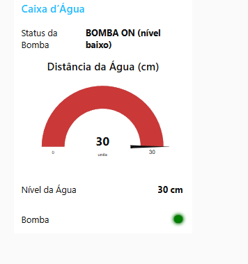
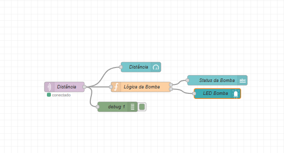
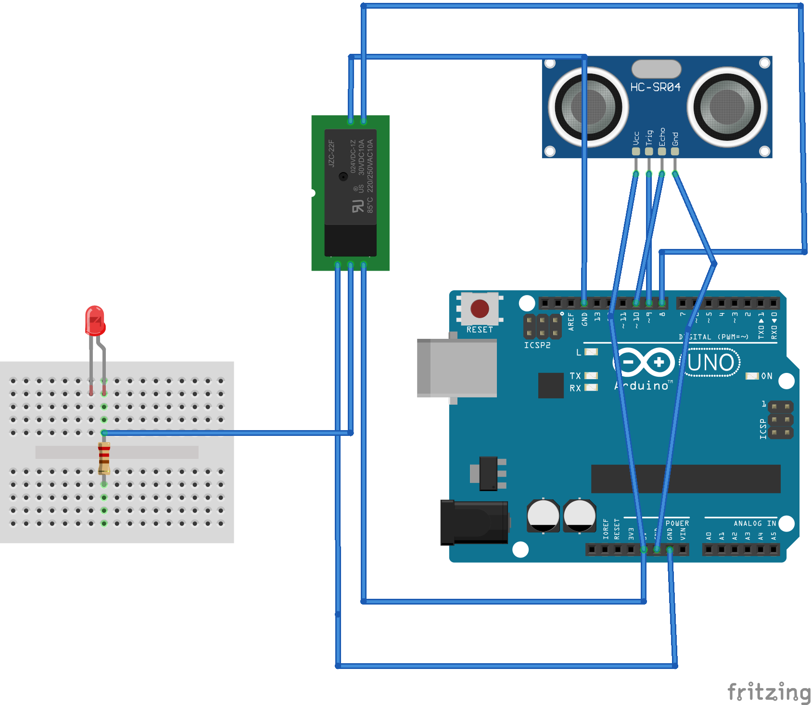
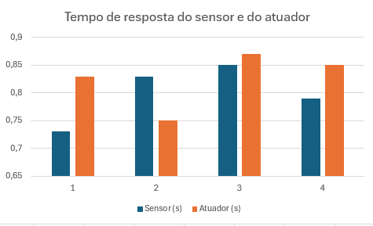

# 💧 Projeto IoT – Monitoramento de Nível de Caixa d’Água

Sistema de IoT desenvolvido como trabalho final da disciplina de Objetos Inteligentes Conectados. O projeto simula um sistema de monitoramento de nível da água com acionamento automático de bomba, utilizando MQTT e Node-RED.

## 👥 Autores
- Caio da Silva Ribeiro – [@caiosilvart535](https://github.com/caiosilvart535)
- Ana Laura da Silva Carlotto – [GitHub da colega]

## 📌 Objetivo
Propor uma solução para controle de nível de água em reservatórios, com base no **ODS 6 – Água Potável e Saneamento**, promovendo uso consciente da água e evitando desperdícios.

## 🧰 Tecnologias e Ferramentas
- Node-RED (simulação completa)
- Mosquitto MQTT Broker
- Arduino Uno (simulado)
- Sensor HC-SR04 (simulado via `inject`)
- LED (atuador da bomba)
- Node-RED Dashboard (visualização)
- Fritzing (diagrama eletrônico)

## 🔁 Funcionamento do Sistema

1. O `inject` simula a leitura do sensor de distância.
2. Os dados são enviados via `mqtt out` ao broker Mosquitto.
3. O `mqtt in` recebe os dados e aplica lógica condicional.
4. O `function node` determina o acionamento da bomba:
   - Se distância > 15 cm → **bomba ligada** (LED verde).
   - Se ≤ 15 cm → **bomba desligada** (LED vermelho).
5. A visualização ocorre via `ui_led`, `ui_text` e `ui_gauge`.

## 📸 Imagens do Sistema

### ✅ Bomba DESLIGADA

### 🚨 Bomba LIGADA

)

### 🔄 Fluxo Node-RED

### ⚡ Diagrama Fritzing

## ⏱️ Resultados

| Medida | Sensor (s) | Atuador (s) |
|--------|------------|-------------|
| 1      | 0,73       | 0,83        |
| 2      | 0,83       | 0,75        |
| 3      | 0,85       | 0,87        |
| 4      | 0,79       | 0,85        |
| **Média** | **0,80**   | **0,83**     |

📊 Gráfico de desempenho:  

📄 [Clique aqui para abrir a Tabela de Medições em PDF](tabela-medicoes.pdf)

---

## 📄 Documentação

- [Fluxo completo Node-RED (.json)](fluxo-node-red.json)
- [Artigo científico final (.pdf)](docs/Projeto IOT OBJETOS INTELIGENTES CONECTADOS, etapa 4 (6).pdf)

---

## 🌐 Comunicação MQTT

A comunicação entre o sensor e o atuador é feita via protocolo MQTT, com um broker Mosquitto local. O sensor publica em `sensor/agua/distancia` e a lógica processa os dados em tempo real, com resposta imediata no painel visual.

---

## 🎥 Vídeo de Demonstração

📺 Link para o vídeo do projeto no YouTube:  
👉 *(Inserir link assim que estiver pronto)*

---

## 📚 Licença
Projeto acadêmico desenvolvido para a Universidade Presbiteriana Mackenzie, com finalidade educacional.

