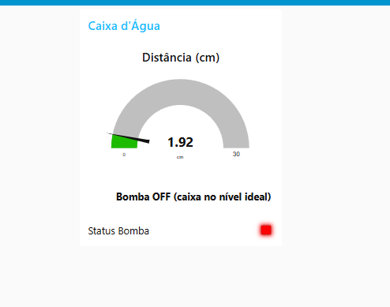
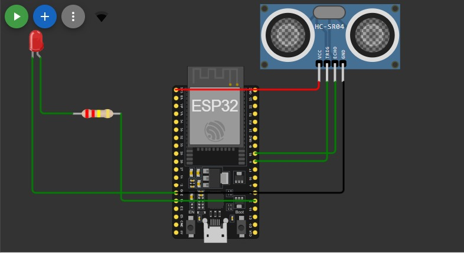

# Projeto: Monitoramento de Nível de Água com IoT

Este projeto simula o monitoramento do nível de uma caixa d'água utilizando ESP32, sensor ultrassônico HC-SR04, protocolo MQTT e dashboard no Node-RED.

## 🚀 Objetivo

Evitar o esvaziamento da caixa d'água e acionar uma bomba virtual automaticamente com base na medição da distância da água.

## 🧰 Tecnologias Utilizadas

- ESP32 (simulado no Wokwi)
- Sensor Ultrassônico HC-SR04
- MQTT (broker: test.mosquitto.org)
- Node-RED
- Wokwi (simulador)
- Fritzing (para o diagrama eletrônico)

## 🔧 Funcionamento

- O ESP32 mede a distância da água.
- Envia os dados para o broker MQTT.
- O Node-RED recebe os dados e aciona o LED e o texto da bomba.

## 📷 Imagens

## 🧪 Testes

O sistema foi testado com dados simulados, variando distâncias de 5 cm a 30 cm. A lógica condicional para acionar a bomba foi validada com sucesso em tempo real.

## 📽️ Vídeo Demonstração

[Assista ao vídeo no YouTube](https://youtu.be/P0lJJ5-vsTs)

## 📁 Artigo Final

Veja o artigo completo em [artigo-final.pdf](artigo-final.pdf)
